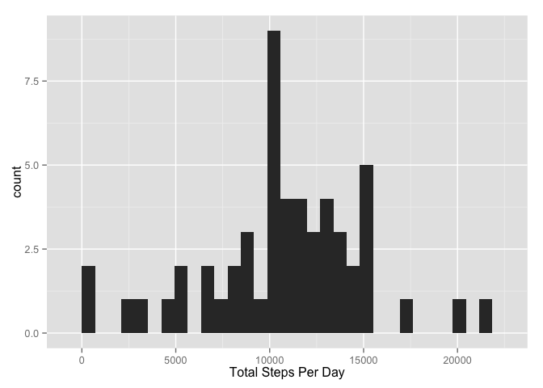
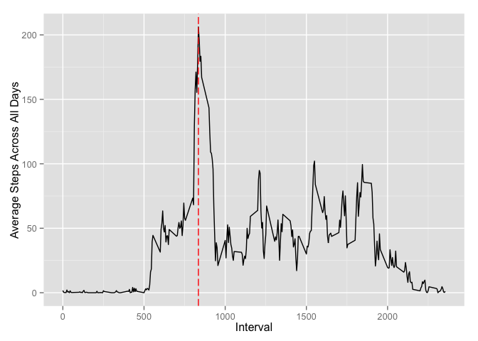
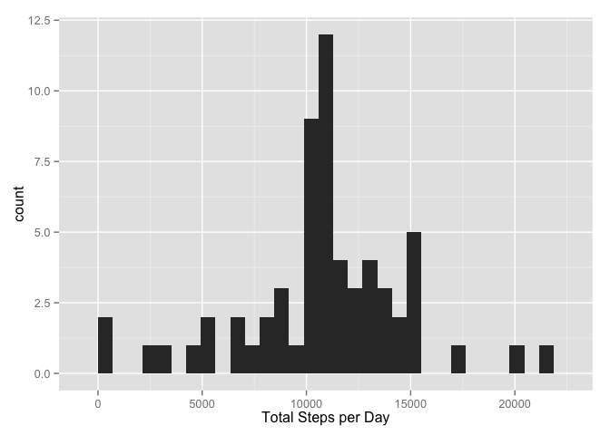
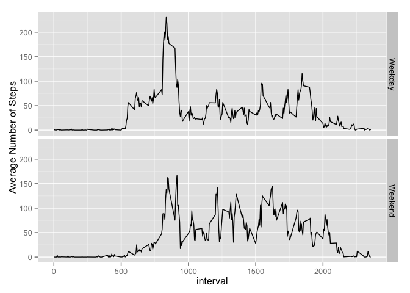

# Reproducible Research: Peer Assessment 1

## Loading the data for the assignment:

```r
data <- read.csv("activity.csv")
data$date <- as.Date(data$date, format = "%Y-%m-%d")
```

## What is the mean total number of steps taken per day?

First, a look at the distribution via a histogram:

```r
library(dplyr)
```

```
## 
## Attaching package: 'dplyr'
## 
## The following objects are masked from 'package:stats':
## 
##     filter, lag
## 
## The following objects are masked from 'package:base':
## 
##     intersect, setdiff, setequal, union
```

```r
library(ggplot2)
# group the data by day
data.daily <- group_by(data, date) %>%
                summarize(StepsPerDay = sum(steps)) 
                
qplot(data.daily$StepsPerDay,geom="histogram", xlab="Total Steps Per Day")
```

```
## stat_bin: binwidth defaulted to range/30. Use 'binwidth = x' to adjust this.
```

 

## What are the mean and median steps per day?

```r
mn <- mean(data.daily$StepsPerDay, na.rm=TRUE)
md <- median(data.daily$StepsPerDay, na.rm = TRUE)
```

The mean is 1.0766 &times; 10<sup>4</sup> and the median is 10765.


## What is the average daily activity pattern?
1. Make a time series plot (i.e. type = "l") of the 5-minute interval (x-axis) and the average number of steps taken, averaged across all days (y-axis)

2. Which 5-minute interval, on average across all the days in the dataset, contains the maximum number of steps?

Plot the the average steps taken across all days, grouped by interval, and add a red dashed line at the interval with the greatest number of average steps taken.

```r
data.interval <- group_by(data, interval) %>%
                        summarize(AvgSteps = mean(steps, na.rm = TRUE))

g <- ggplot(data.interval, aes(interval, AvgSteps))
g + geom_line() + geom_vline(xintercept = data.interval$interval[which.max(data.interval$AvgSteps)],
                             color = "red", linetype = "longdash") +
        xlab("Interval") + ylab("Average Steps Across All Days")
```

 

## Imputing missing values
1. Calculate and report the total number of missing values in the dataset (i.e. the total number of rows with NAs)

```r
total.na <- sum(is.na(data$steps))
```
The total number of NA values in the dataset is 2304.

2. Devise a strategy for filling in all of the missing values in the dataset. The strategy does not need to be sophisticated. For example, you could use the mean/median for that day, or the mean for that 5-minute interval, etc.

3. Create a new dataset that is equal to the original dataset but with the missing data filled in.

Replace NAs with the mean for the given interval:

```r
data.no.na <- data
for (i in 1:length(data$steps)) {
if (is.na(data$steps[i]) == TRUE) {
data.no.na$steps[i]  <-  mean(data$steps[data$interval == data$interval[i]], na.rm = TRUE)
}
}
```

4. Make a histogram of the total number of steps taken each day and Calculate and report the mean and median total number of steps taken per day. Do these values differ from the estimates from the first part of the assignment? What is the impact of imputing missing data on the estimates of the total daily number of steps?

```r
data.no.na.daily <- group_by(data.no.na, date) %>%
                summarize(StepsPerDay = sum(steps))
mean.no.na <- mean(data.no.na.daily$StepsPerDay)
median.no.na <- median(data.no.na.daily$StepsPerDay)
qplot(data.no.na.daily$StepsPerDay, xlab = "Total Steps per Day")
```

```
## stat_bin: binwidth defaulted to range/30. Use 'binwidth = x' to adjust this.
```

 

With the NA values replaced, the mean is 1.0766 &times; 10<sup>4</sup> and the median is 1.0766 &times; 10<sup>4</sup>.

## Any differences in activity patterns between weekdays and weekends?

1. Create a new factor variable in the dataset with two levels – “weekday” and “weekend” indicating whether a given date is a weekday or weekend day.

```r
for (i in 1:length(data.no.na$date)) {
if (weekdays(data.no.na$date[i]) %in% c("Saturday", "Sunday")) {
data.no.na$DayOfWeek[i] <- "Weekend"
} else {data.no.na$DayOfWeek[i] <- "Weekday"}
}
```

2. Make a panel plot containing a time series plot (i.e. type = "l") of the 5-minute interval (x-axis) and the average number of steps taken, averaged across all weekday days or weekend days (y-axis).

```r
data.no.na.interval <- group_by(data.no.na, interval, DayOfWeek) %>%
                        summarize(AvgSteps = mean(steps))
g2 <- ggplot(data.no.na.interval, aes(interval, AvgSteps))
g2 + geom_line() + facet_grid(DayOfWeek ~ .) + ylab("Average Number of Steps")
```

 
